# 🧠 DevPilot — Technical Deep Dive

> A comprehensive guide to how DevPilot works under the hood — every module, class, function, and data flow explained.
> 
> 📄 **Architecture Guide**: [DevPilot Architecture & Workflow Guide (PDF)](file:///e:/Projects/GitHub/DevPilot/docs/DevPilot_Architecture_and_Workflow.pdf)  
> 📜 **Git Commits Roadmap (22 Commits)**: [GIT_COMMITS.md](file:///e:/Projects/GitHub/DevPilot/GIT_COMMITS.md)  
> 📘 **Project Overview**: [README.md](file:///e:/Projects/GitHub/DevPilot/README.md)

---

## Table of Contents

- [System Overview](#system-overview)
- [1. Authentication Flow](#1-authentication-flow)
- [2. Repository Sync Pipeline](#2-repository-sync-pipeline)
- [3. Code Indexing Pipeline (The Core)](#3-code-indexing-pipeline-the-core)
- [4. Vector Storage (PgVector)](#4-vector-storage-pgvector)
- [5. RAG Chat Pipeline](#5-rag-chat-pipeline)
- [6. Frontend Architecture](#6-frontend-architecture)
- [7. Class & Function Reference](#7-class--function-reference)
- [8. Data Flow Diagrams](#8-data-flow-diagrams)
- [9. Database Schema](#9-database-schema)

---

## System Overview

DevPilot is a **Retrieval-Augmented Generation (RAG)** platform that lets you chat with your GitHub codebases. It works in three major phases:


| Phase | What Happens |
|-------|-------------|
| **Auth** | User signs in via GitHub OAuth2. Token encrypted & stored. |
| **Sync** | All user repos fetched from GitHub API, upserted into `repositories` table. |
| **Index** | Each file is fetched, filtered, chunked, embedded into 3072-dim vectors, saved to pgvector. |
| **Chat** | User question → cosine similarity search → top-K code chunks → LLM prompt → streamed answer. |

---

## 1. Authentication Flow

### Workflow

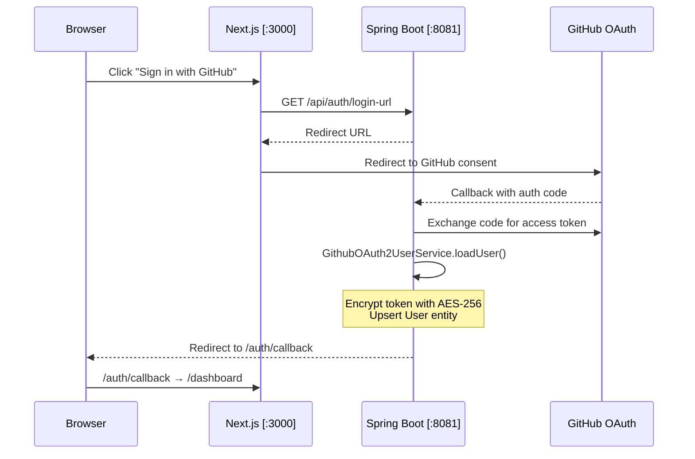

### Key Classes & Functions

| Class | Function | Responsibility |
|-------|----------|---------------|
| [`SecurityConfig`](file:///e:/Projects/GitHub/DevPilot/backend/src/main/java/devPilot/backend/config/SecurityConfig.java) | `securityFilterChain()` | Configures OAuth2 login, session management, CORS, CSRF disabled |
| [`GithubOAuth2UserService`](file:///e:/Projects/GitHub/DevPilot/backend/src/main/java/devPilot/backend/security/GithubOAuth2UserService.java) | `loadUser()` | Called after OAuth2 callback. Extracts GitHub profile, encrypts access token, creates/updates `User` entity |
| [`CryptoConfig`](file:///e:/Projects/GitHub/DevPilot/backend/src/main/java/devPilot/backend/config/CryptoConfig.java) | `textEncryptor()` | Provides AES-256 `TextEncryptor` bean using configurable password & salt |
| [`UserService`](file:///e:/Projects/GitHub/DevPilot/backend/src/main/java/devPilot/backend/services/UserService.java) | `decryptAccessToken()` | Decrypts stored GitHub token for API calls |
| [`CurrentUser`](file:///e:/Projects/GitHub/DevPilot/backend/src/main/java/devPilot/backend/security/CurrentUser.java) | `require()` | Extracts authenticated user from Spring Security context |

---

## 2. Repository Sync Pipeline

### Workflow

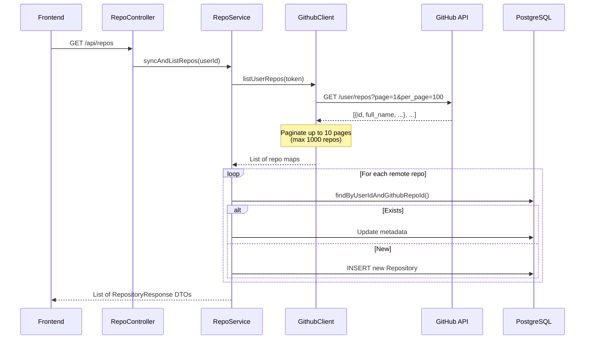

### Key Classes & Functions

| Class | Function | Responsibility |
|-------|----------|---------------|
| [`RepoController`](file:///e:/Projects/GitHub/DevPilot/backend/src/main/java/devPilot/backend/controller/RepoController.java) | `list()` | `GET /api/repos` — triggers sync |
| [`RepoService`](file:///e:/Projects/GitHub/DevPilot/backend/src/main/java/devPilot/backend/services/RepoService.java) | `syncAndListRepos()` | Orchestrates: fetch from GitHub → upsert → return sorted list |
| [`GithubClient`](file:///e:/Projects/GitHub/DevPilot/backend/src/main/java/devPilot/backend/services/github/GithubClient.java) | `listUserRepos()` | Paginated GitHub REST API call (owner + collaborator + org repos) |
| [`GithubClient`](file:///e:/Projects/GitHub/DevPilot/backend/src/main/java/devPilot/backend/services/github/GithubClient.java) | `getRepoTree()` | `GET /repos/{owner}/{repo}/git/trees/{branch}?recursive=1` |
| [`GithubClient`](file:///e:/Projects/GitHub/DevPilot/backend/src/main/java/devPilot/backend/services/github/GithubClient.java) | `getFileContent()` | `GET /repos/{owner}/{repo}/contents/{path}` — Base64 decode |
| [`GitHubRateLimiter`](file:///e:/Projects/GitHub/DevPilot/backend/src/main/java/devPilot/backend/services/github/GitHubRateLimiter.java) | `pause()` | Configurable delay between GitHub API calls (`app.github.api-delay-ms`) |

---

## 3. Code Indexing Pipeline (The Core)

This is the **heart of DevPilot** — it transforms raw source code into searchable vector embeddings.

### End-to-End Indexing Workflow

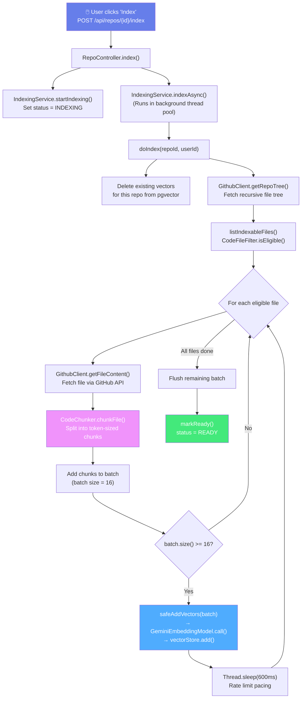

### Step-by-Step Breakdown

#### Step 1: Trigger Indexing
- **Endpoint**: `POST /api/repos/{id}/index`
- **Class**: [`RepoController`](file:///e:/Projects/GitHub/DevPilot/backend/src/main/java/devPilot/backend/controller/RepoController.java) → `index()`
- Sets `IndexStatus.INDEXING`, resets counters, then fires `indexAsync()` on a background thread.

#### Step 2: Fetch Repository Tree
- **Class**: [`GithubClient`](file:///e:/Projects/GitHub/DevPilot/backend/src/main/java/devPilot/backend/services/github/GithubClient.java) → `getRepoTree()`
- Calls `GET /repos/{owner}/{repo}/git/trees/{branch}?recursive=1`
- Returns **every file and directory** in the repo as a flat list.

#### Step 3: Filter Eligible Files
- **Class**: [`CodeFileFilter`](file:///e:/Projects/GitHub/DevPilot/backend/src/main/java/devPilot/backend/services/indexing/CodeFileFilter.java) → `isEligible(path, size, maxBytes)`
- **Skips directories**: `node_modules`, `.git`, `dist`, `build`, `target`, `.next`, `vendor`, `__pycache__`
- **Skips lock files**: `package-lock.json`, `yarn.lock`, `pnpm-lock.yaml`, etc.
- **Skips hidden files**: Files starting with `.`
- **Skips oversized files**: > `app.indexing.max-file-bytes` (default 100KB)
- **Allows extensions**: `java`, `ts`, `tsx`, `js`, `py`, `go`, `rs`, `html`, `css`, `yml`, `json`, `sql`, `md`, etc. (36+ extensions)

#### Step 4: Fetch File Content
- **Class**: [`GithubClient`](file:///e:/Projects/GitHub/DevPilot/backend/src/main/java/devPilot/backend/services/github/GithubClient.java) → `getFileContent()`
- GitHub returns content as Base64-encoded strings
- Decoded to UTF-8 text

#### Step 5: Chunk Code Files
- **Class**: [`CodeChunker`](file:///e:/Projects/GitHub/DevPilot/backend/src/main/java/devPilot/backend/services/indexing/CodeChunker.java) → `chunkFile()`
- Uses Spring AI's `TokenTextSplitter` to split by tokens (~200 tokens per chunk, derived from `chunk-size=800` chars ÷ 4)
- Each chunk gets a **header**: `// File: path/to/file.java\n`
- Each chunk carries **metadata**:

```json
{
  "repoId": "uuid-of-repository",
  "filePath": "src/main/java/Calculator.java",
  "language": "java",
  "chunkIndex": 0
}
```

#### Step 6: Embed & Store Vectors
- **Class**: [`GeminiEmbeddingModel`](file:///e:/Projects/GitHub/DevPilot/backend/src/main/java/devPilot/backend/services/ai/GeminiEmbeddingModel.java) → `call(EmbeddingRequest)`
- Calls Gemini's `/v1beta/openai/embeddings` endpoint directly via `RestClient`
- **Why custom?** — Google Gemini's OpenAI-compatible endpoint omits the `"index"` field in embedding responses, which crashes Spring AI's default `OpenAiEmbeddingModel`. Our custom model parses the JSON directly and synthesizes index positions.
- Returns `3072-dimensional` float vectors
- Includes built-in **429 rate limit backoff** with automatic retry (up to 5 attempts)

### Detailed Chunking & Embedding Flow

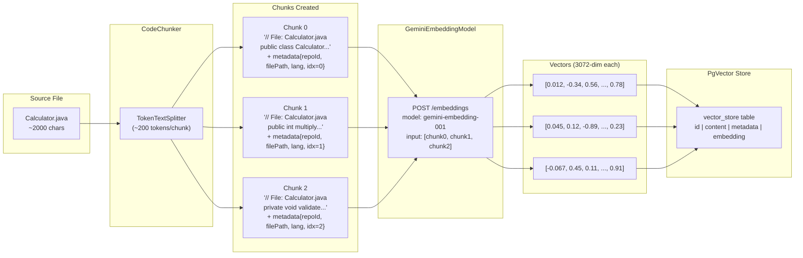

### Key Classes & Functions

| Class | Function | Responsibility |
|-------|----------|---------------|
| [`IndexingService`](file:///e:/Projects/GitHub/DevPilot/backend/src/main/java/devPilot/backend/services/indexing/IndexingService.java) | `startIndexing()` | Sets status to `INDEXING`, resets counters |
| [`IndexingService`](file:///e:/Projects/GitHub/DevPilot/backend/src/main/java/devPilot/backend/services/indexing/IndexingService.java) | `indexAsync()` | `@Async` entry point on dedicated thread pool |
| [`IndexingService`](file:///e:/Projects/GitHub/DevPilot/backend/src/main/java/devPilot/backend/services/indexing/IndexingService.java) | `doIndex()` | Main loop: tree → filter → fetch → chunk → batch → embed → store |
| [`IndexingService`](file:///e:/Projects/GitHub/DevPilot/backend/src/main/java/devPilot/backend/services/indexing/IndexingService.java) | `safeAddVectors()` | Wraps `vectorStore.add()` with rate-limit retry logic |
| [`IndexingService`](file:///e:/Projects/GitHub/DevPilot/backend/src/main/java/devPilot/backend/services/indexing/IndexingService.java) | `listIndexableFiles()` | Parses tree JSON, delegates to `CodeFileFilter` |
| [`IndexingService`](file:///e:/Projects/GitHub/DevPilot/backend/src/main/java/devPilot/backend/services/indexing/IndexingService.java) | `deleteExistingVectors()` | Removes old vectors for this repo before re-indexing |
| [`IndexingService`](file:///e:/Projects/GitHub/DevPilot/backend/src/main/java/devPilot/backend/services/indexing/IndexingService.java) | `updateProgress()` | Persists file counts every 5 files (UI polls this) |
| [`IndexingService`](file:///e:/Projects/GitHub/DevPilot/backend/src/main/java/devPilot/backend/services/indexing/IndexingService.java) | `markReady()` | Sets `READY` status + timestamps on success |
| [`IndexingService`](file:///e:/Projects/GitHub/DevPilot/backend/src/main/java/devPilot/backend/services/indexing/IndexingService.java) | `markFailed()` | Sets `FAILED` status + error message |
| [`CodeFileFilter`](file:///e:/Projects/GitHub/DevPilot/backend/src/main/java/devPilot/backend/services/indexing/CodeFileFilter.java) | `isEligible()` | Checks path, extension, size, skip-patterns |
| [`CodeFileFilter`](file:///e:/Projects/GitHub/DevPilot/backend/src/main/java/devPilot/backend/services/indexing/CodeFileFilter.java) | `detectLanguage()` | Extracts language from file extension |
| [`CodeChunker`](file:///e:/Projects/GitHub/DevPilot/backend/src/main/java/devPilot/backend/services/indexing/CodeChunker.java) | `chunkFile()` | Prepends file header, splits with `TokenTextSplitter`, attaches metadata |
| [`GeminiEmbeddingModel`](file:///e:/Projects/GitHub/DevPilot/backend/src/main/java/devPilot/backend/services/ai/GeminiEmbeddingModel.java) | `call()` | Entry point — delegates to `fetchEmbeddingsWithRetry()` |
| [`GeminiEmbeddingModel`](file:///e:/Projects/GitHub/DevPilot/backend/src/main/java/devPilot/backend/services/ai/GeminiEmbeddingModel.java) | `fetchEmbeddingsWithRetry()` | HTTP POST to Gemini, handles 429/retry |
| [`GeminiEmbeddingModel`](file:///e:/Projects/GitHub/DevPilot/backend/src/main/java/devPilot/backend/services/ai/GeminiEmbeddingModel.java) | `parseEmbeddingResponse()` | JSON → float[] arrays with synthetic index |
| [`GeminiEmbeddingModel`](file:///e:/Projects/GitHub/DevPilot/backend/src/main/java/devPilot/backend/services/ai/GeminiEmbeddingModel.java) | `extractRetryDelayMs()` | Parses `"Please retry in 31.5s"` from error body |

---

## 4. Vector Storage (PgVector)

### How Vectors Are Stored

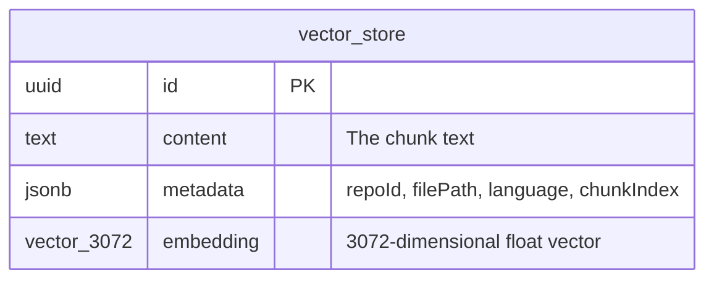

### Configuration

```properties
spring.ai.vectorstore.pgvector.initialize-schema=true
spring.ai.vectorstore.pgvector.dimensions=3072
spring.ai.vectorstore.pgvector.index-type=NONE
spring.ai.vectorstore.pgvector.distance-type=COSINE_DISTANCE
```

> [!IMPORTANT]
> **Why `index-type=NONE`?** PostgreSQL's HNSW and IVFFLAT indexes have a **2000-dimension limit**. Since Gemini embeddings are 3072-dimensional, we use exact cosine distance search (no index). This is acceptable for the typical dataset sizes in a personal code assistant.

### Similarity Search Query (What pgvector executes)

```sql
SELECT id, content, metadata, embedding
FROM vector_store
WHERE metadata->>'repoId' = '<repo-uuid>'
ORDER BY embedding <=> '<query-embedding>'::vector
LIMIT 8;
```

The `<=>` operator computes **cosine distance** between the query vector and each stored vector.

---

## 5. RAG Chat Pipeline

### End-to-End Chat Flow

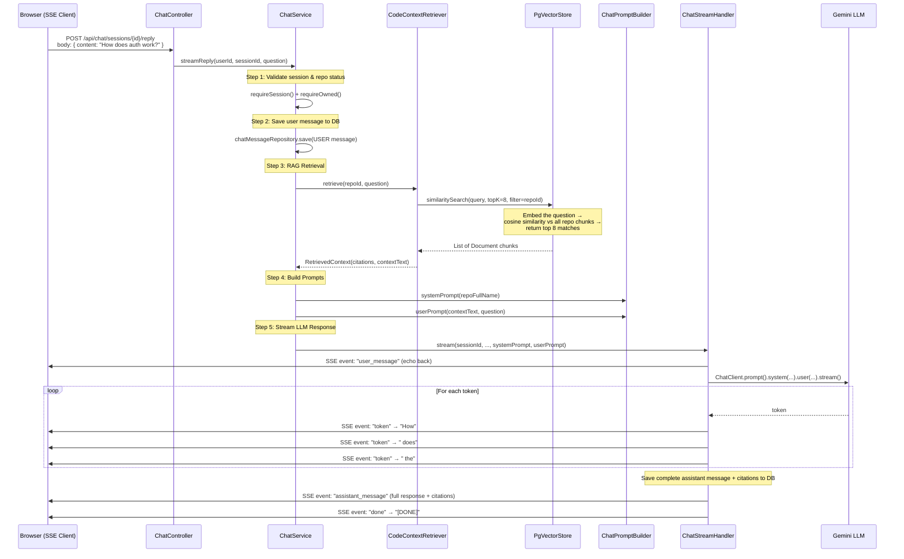

### The System Prompt

```text
You are DevPilot, an expert assistant for the {owner/repo} codebase.
Answer using ONLY the provided code context.
If the context is insufficient, say you are unsure.
Cite file paths and line ranges when relevant.
Be concise and technical.
```

### The User Prompt (with RAG context injected)

```text
Code context:
// File: src/auth/SecurityConfig.java
@Configuration
public class SecurityConfig {
    @Bean
    SecurityFilterChain securityFilterChain(...) {
        http.oauth2Login(...)
    }
}

---

// File: src/security/GithubOAuth2UserService.java
public class GithubOAuth2UserService extends DefaultOAuth2UserService {
    public OAuth2User loadUser(...) { ... }
}

User question:
How does authentication work in this project?
```

### Key Classes & Functions

| Class | Function | Responsibility |
|-------|----------|---------------|
| [`ChatController`](file:///e:/Projects/GitHub/DevPilot/backend/src/main/java/devPilot/backend/controller/ChatController.java) | `reply()` | `POST /api/chat/sessions/{id}/reply` — returns `SseEmitter` |
| [`ChatService`](file:///e:/Projects/GitHub/DevPilot/backend/src/main/java/devPilot/backend/services/ChatService.java) | `streamReply()` | Orchestrates the full RAG pipeline (5 steps) |
| [`ChatService`](file:///e:/Projects/GitHub/DevPilot/backend/src/main/java/devPilot/backend/services/ChatService.java) | `createSession()` | Creates a new chat session for a repository |
| [`ChatService`](file:///e:/Projects/GitHub/DevPilot/backend/src/main/java/devPilot/backend/services/ChatService.java) | `getMessages()` | Returns message history for a session |
| [`CodeContextRetriever`](file:///e:/Projects/GitHub/DevPilot/backend/src/main/java/devPilot/backend/services/ai/CodeContextRetriever.java) | `retrieve()` | Builds filter (repoId), runs similarity search (top-K=8), maps to citations |
| [`ChatPromptBuilder`](file:///e:/Projects/GitHub/DevPilot/backend/src/main/java/devPilot/backend/services/ai/ChatPromptBuilder.java) | `systemPrompt()` | Generates system instruction with repo name |
| [`ChatPromptBuilder`](file:///e:/Projects/GitHub/DevPilot/backend/src/main/java/devPilot/backend/services/ai/ChatPromptBuilder.java) | `userPrompt()` | Combines retrieved code context + user question |
| [`ChatStreamHandler`](file:///e:/Projects/GitHub/DevPilot/backend/src/main/java/devPilot/backend/services/ai/ChatStreamHandler.java) | `stream()` | Creates SSE emitter, calls `ChatClient.stream()`, emits tokens |
| [`ChatStreamHandler`](file:///e:/Projects/GitHub/DevPilot/backend/src/main/java/devPilot/backend/services/ai/ChatStreamHandler.java) | `appendToken()` | Sends each token via SSE as it arrives |
| [`ChatStreamHandler`](file:///e:/Projects/GitHub/DevPilot/backend/src/main/java/devPilot/backend/services/ai/ChatStreamHandler.java) | `completeStream()` | Saves full assistant message + citations to DB, sends `[DONE]` |
| [`CitationMapper`](file:///e:/Projects/GitHub/DevPilot/backend/src/main/java/devPilot/backend/services/ai/CitationMapper.java) | `fromDocument()` | Extracts `filePath`, `startLine`, `endLine`, `language` from vector metadata |
| [`CitationMapper`](file:///e:/Projects/GitHub/DevPilot/backend/src/main/java/devPilot/backend/services/ai/CitationMapper.java) | `toJson()` / `fromJson()` | Serializes/deserializes citation lists for DB storage |
| [`RagSettings`](file:///e:/Projects/GitHub/DevPilot/backend/src/main/java/devPilot/backend/services/ai/RagSettings.java) | *(constants)* | `TOP_K_CHUNKS=8`, `STREAM_TIMEOUT_MS=180000`, `METADATA_REPO_ID="repoId"` |

---

## 6. Frontend Architecture

### Component Tree

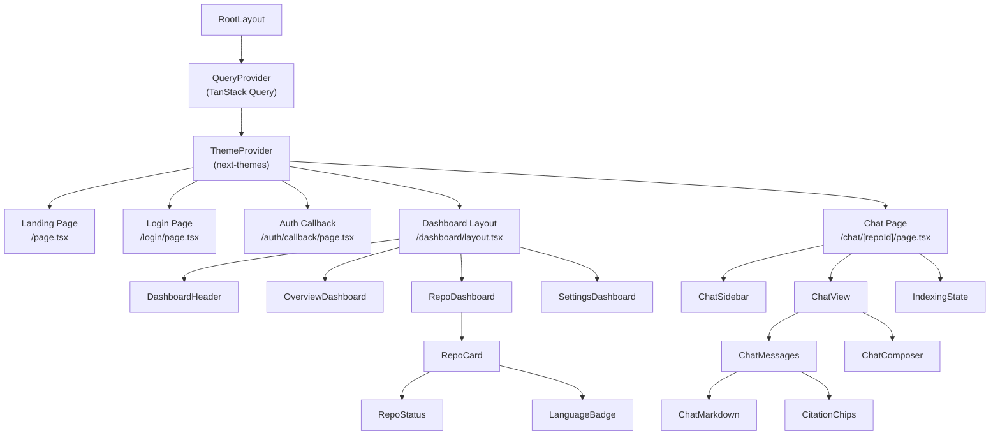

### Key Frontend Hooks

| Hook | File | Responsibility |
|------|------|---------------|
| `useAuth()` | `hooks/use-auth.ts` | Manages login state, user profile, logout |
| `useRepos()` | `hooks/use-repos.ts` | Fetches repos, triggers indexing, polls status |
| `useChat()` | `hooks/use-chat.ts` | Manages chat sessions, sends messages, parses SSE stream |
| `useMobile()` | `hooks/use-mobile.ts` | Responsive breakpoint detection |

### SSE Stream Parsing (Frontend)

The frontend's `stream-chat.ts` connects to the SSE endpoint and processes events:

```
Event: "user_message"  → Display user bubble
Event: "token"         → Append to streaming assistant response
Event: "assistant_message" → Replace stream with final message + citations
Event: "done"          → Close connection
```

---

## 7. Class & Function Reference

### Backend Package Map

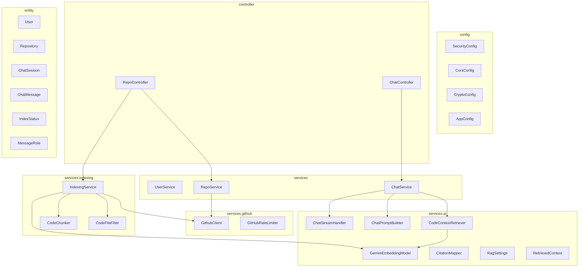

---

## 8. Data Flow Diagrams

### Complete Data Pipeline — From GitHub to Chat Answer

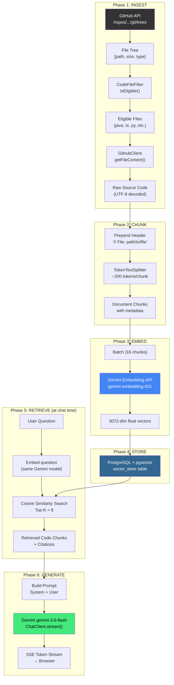

### Index Status State Machine

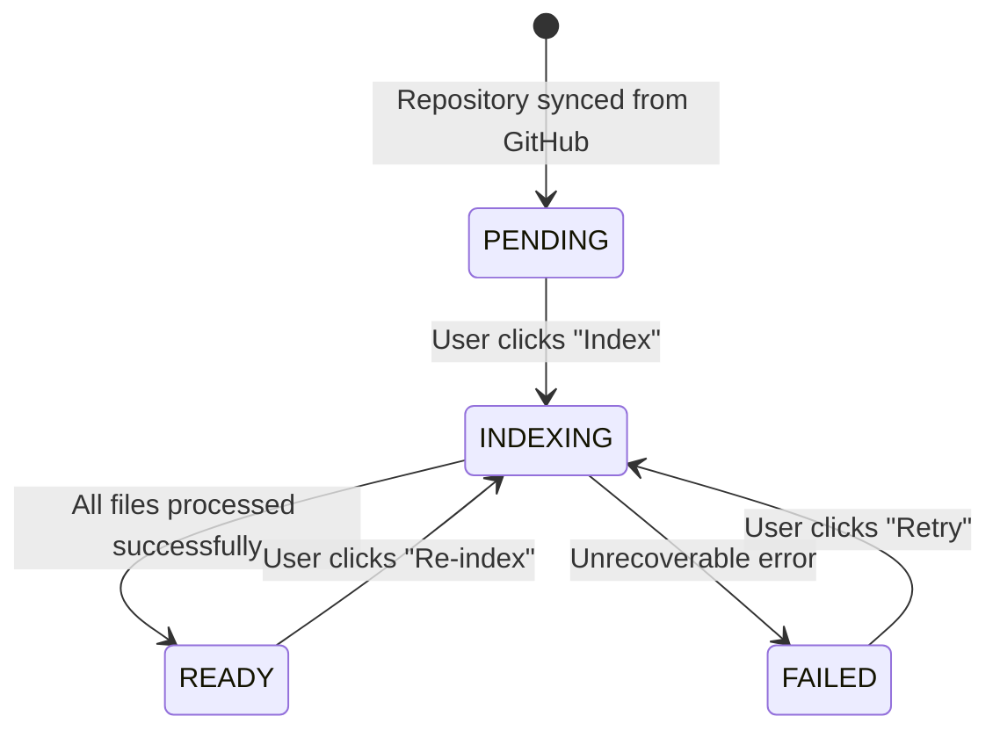

---

## 9. Database Schema

### Entity Relationship Diagram

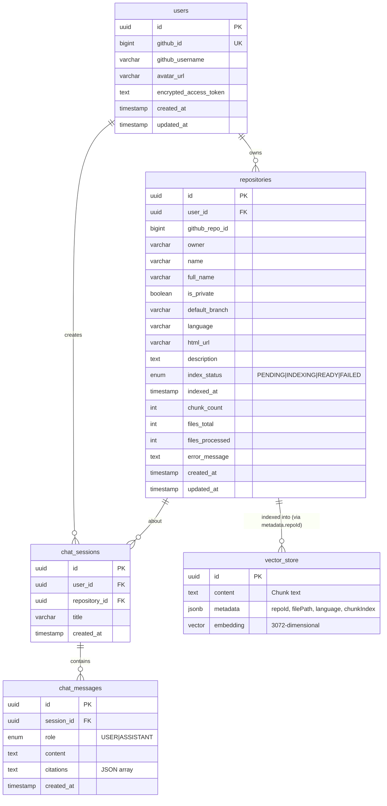

---

## Configuration Reference

### Backend (`application.properties`)

| Property | Default | Description |
|----------|---------|-------------|
| `server.port` | `8081` | Backend HTTP port |
| `spring.ai.openai.base-url` | `https://generativelanguage.googleapis.com/v1beta/openai/` | Gemini's OpenAI-compatible base URL |
| `spring.ai.openai.api-key` | *(required)* | Your Gemini API key |
| `spring.ai.openai.chat.model` | `gemini-3.6-flash` | Chat model name |
| `spring.ai.openai.embedding.model` | `gemini-embedding-001` | Embedding model name |
| `spring.ai.vectorstore.pgvector.dimensions` | `3072` | Vector dimensions (must match embedding model) |
| `spring.ai.vectorstore.pgvector.index-type` | `NONE` | No index (3072 > HNSW limit of 2000) |
| `spring.ai.vectorstore.pgvector.distance-type` | `COSINE_DISTANCE` | Distance metric for similarity search |
| `app.indexing.max-file-bytes` | `102400` | Max file size to index (100KB) |
| `app.indexing.chunk-size` | `800` | Approx chars per chunk |
| `app.github.api-delay-ms` | `50` | Delay between GitHub API calls |

### Frontend (`client/.env.local`)

| Variable | Default | Description |
|----------|---------|-------------|
| `NEXT_PUBLIC_API_URL` | `http://localhost:8081` | Backend API base URL |

---

## Commands Reference

| Command | Purpose |
|---------|---------|
| `docker compose up -d` | Start PostgreSQL with pgvector |
| `cd backend && ./mvnw spring-boot:run` | Start backend (port 8081) |
| `cd client && npm run dev` | Start frontend (port 3000) |
| `cd backend && ./mvnw compile` | Compile backend only |
| `cd backend && ./mvnw test` | Run backend tests |
| `cd client && npm run build` | Production build of frontend |
